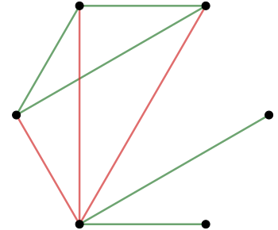

Queremos probar el siguiente enunciado, conocido como el *teorema de la amistad*.

>En cualquier grupo de seis personas existen siempre tres que se conocen mutuamante, o que se desconocen entre sí.

::: {.callout-note}

Es útil abordar este problema con la terminología de grafos. Se considera un grafo con 6 vértices, donde cada vértice es una persona distinta, y los segmentos que los unen son las relaciones entre ellos. A este tipo de grafo se le conoce como grafo completo. En particular, cuando un grafo tiene $n$ vértices y cada par de vértices está conectado, se le denota como $K_n$.

:::

::: {.callout-tip}

Por ejemplo, un grafo completo de 3 vértices se representa como $K_3$, o como un ciclo de longitud 3 $C_3$, conocido como triángulo.

:::

Se considera ahora un $K_6$, que tiene un total de 15 aristas. Si se colorean las aristas con rojo o verde dependiendo de si las personas representadas por los vértices incidentes son conocidas o desconocidas entre sí, respectivamente, el *teorema de la amistad* establece lo siguiente:

> Independientemente de cómo se coloreen las aristas de $K_6$ con rojo o verde, siempre habrá un triángulo rojo, es decir, un conjunto de tres personas que son mutuamente desconocidas, o un triángulo verde, que representa tres personas que se conocen entre sí.

::: {#thm-seis-desconocidos}

Cualquier coloración de $K_6$ con dos colores tiene al menos un  triángulo ($C_3$) cuyos lados son del mismo color.
:::

::: {.proof}

Se elige uno de los vértices $P$ de $K_6$. Existen cinco aristas incidentes sobre $P$. Cada una de estas aristas está coloreada con color rojo (desconocidos) o verde (conocidos). Aplicamos el *Principio del Palomar* que nos asegura que, al menos, tres aristas son del mismo color.

::: {layout-ncol=2}

{width=60%}

{width=60%}

:::

Sean $A,B,C$ los otros vértices opuestos a $P$ de estas tres aristas del mismo color, supongamos que son de color rojo. Si alguna de las aristas $AB,AC,BC$ es roja, junto a las aristas incidentes sobre $P$ se encuentra el triángulo rojo (personas desconocidas entre sí). 

{width=30%}

Si ninguna de las 3 aristas anteriores es roja, se tiene que las 3 son verdes obteniendo un triángulo de color verde $ABC$ (personas mutuamente conocidas).

{width=30%}

:::

En la siguiente aplicación, pulsa "Recalcular" para colorear los lados de forma aleatoria en rojo y azul.

